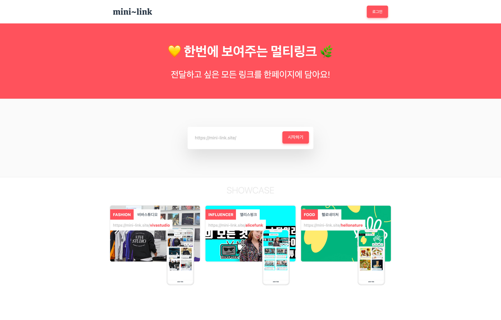
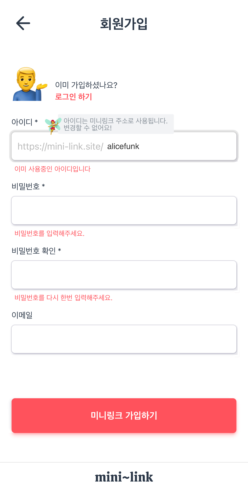
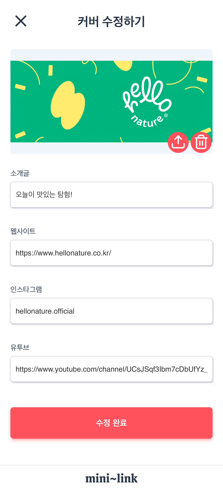
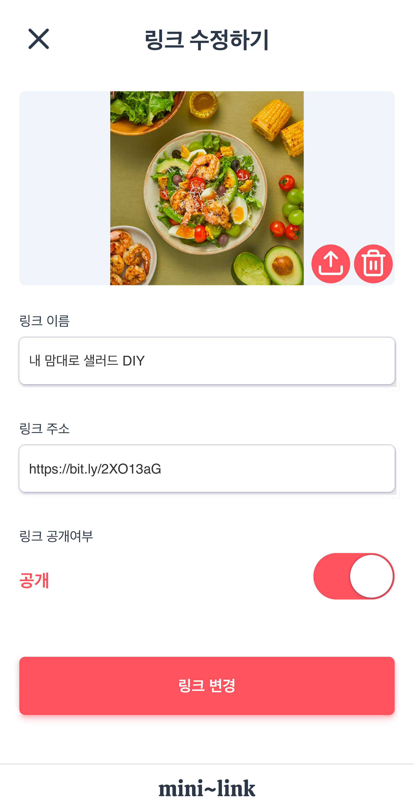

# Introduction
- https://mini-link.site/
- 소셜 프로필에서 전달하고 싶은 링크를 한 페이지에 담는 멀티링크 서비스
- 인스타그램 프로필에서 주로 사용되는 [링크트리](https://linktr.ee/) 형태

# Feature
- 계정별 멀티링크를 담은 페이지 생성
- 서버사이드렌더링으로 페이지에 SEO 적용
- 페이지 커버이미지, 소개글, 웹사이트, 인스타그램, 유투브 링크 관리
- 링크별 썸네일이미지, 링크이름, URL, 공개여부 관리
- 커버이미지 업로드 시, 주요 색상을 추출하여 배경색으로 사용
- 관리자 페이지에서 페이지 방문자, 링크별 클릭수 데이터 확인
- Web Share API 사용한 네이티브 공유 기능 (폴백 적용)
- NAVER Cloud GeoLocation API를 통해 ip로 접속한 방문자의 대략적인 위도, 경도, 주소 정보를 수집

# Example
※ 모든 페이지는 예시를 위한 작업으로 실제 업체가 운영하는 페이지가 아닙니다.

1. 메인홈페이지 (생성하고 싶은 아이디 입력 시, 해당 아이디로 회원가입 시작)
  

2. 회원가입
  

3. 관리자페이지 (페이지 방문자, 링크별 클릭수 데이터 확인)
  

4. 페이지 수정 (페이지 커버이미지, 소개글로 SEO 반영)
  

5. 링크 수정 (링크별 썸네일이미지, 링크이름, URL, 공개여부 관리)
  

6. 페이지 방문자들이 보게 될 페이지
  

# Skills

## (1) Frontend
- Next.js
- React Hook
- Redux Toolkit
- redux-saga
- styled-component
- react-hook-form
- axios

## (2) Backend
- Express
- MySQL
- Sequelize
- Passport

## (3) Deployment
- AWS EC2를 이용한 Frontend, Backend 서버를 각각 배포
- Nginx를 이용한 리버스프록시 설정 및 HTTPS/SSL 적용
- pm2를 이용한 Node.js 프로세스 관리
- 이미지 스토리지로 AWS S3 사용

# Installation
## (1) Frontend
```sh
git clone https://github.com/dwook/mini-link.git
cd front
npm install
npm run build
npx pm2 start npm -- start
```
## (2) Backend
```sh
git clone https://github.com/dwook/mini-link.git
cd back
npm install
npx sequelize db:create
npm run start
```
- Backend 환경변수 설정
  - AWS S3 리소스에 접근가능한 ACCESS_KEY_ID, SECRET_ACCESS_KEY를 발급 후 작성
  - [NAVER Cloud GeoLocation](https://docs.ncloud.com/ko/api/api-2-1.html) 이용신청 후 ACCESS_KEY, SECRET_KEY 작성

```
COOKIE_SECRET=
DB_PASSWORD=
S3_ACCESS_KEY_ID=
S3_SECRET_ACCESS_KEY=
NAVER_GEO_ACCESS_KEY=
NAVER_GEO_SECRET_KEY=
```

# Things to do
- [ ] 프론트엔드 테스트 코드 작성
- [ ] 백엔드 테스트 코드 작성
- [ ] 접속 로그를 활용한 데이터 시각화. 페이지 방문 또는 링크 클릭 시, user agent 정보와 ip를 통한 지리정보를 수집했으나 활용하지 못했다.
